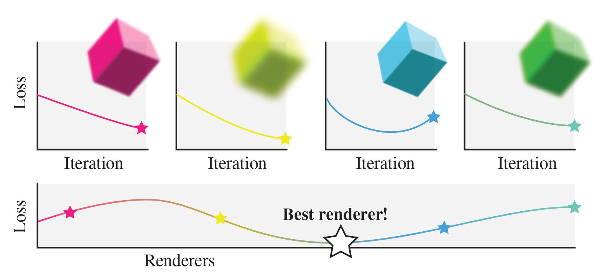

# Learning to Rasterize Differentiably (Updating...)



This is the official code implementation for our EGSR 2024 Paper Learning to Rasterize Differentiably.

## Requirements 
CUDA Toolkit (for compilation), and [PyTorch>=1.9.0](https://pytorch.org/get-started/locally/) (matching the CUDA version).

For example:

```shell
pip3 install torch torchvision torchaudio --index-url https://download.pytorch.org/whl/cu118
```
>If failed please refer to the official website and try different versions.

And then we recommand to create a new conda environment.

```shell
conda env create -n metaras -f metaras.yml
conda activate metaras
```

## Setup

Clone this repo and insatll

```shell
git clone https://github.com/Theo-Wu/MetaRas.git && cd MetaRas
pip install .
```
